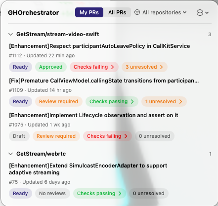
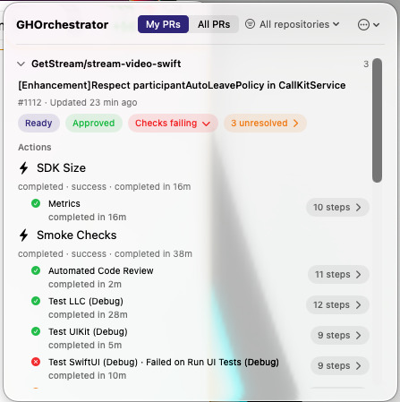
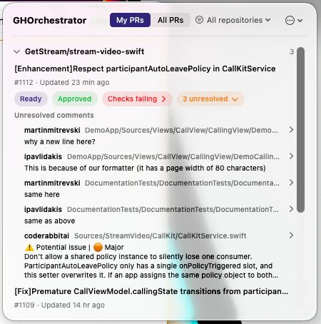
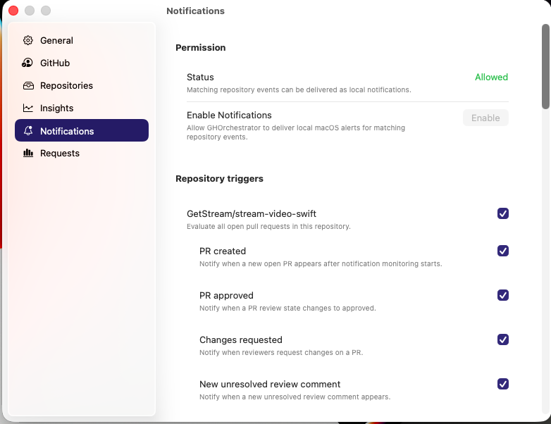
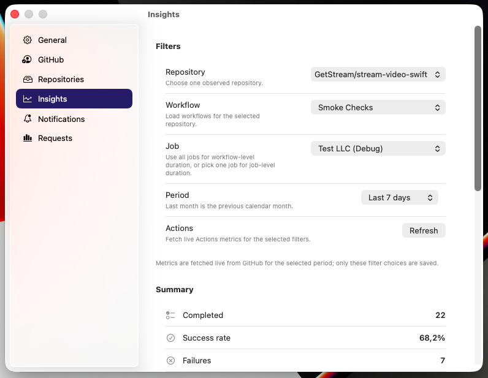

# GHOrchestrator

GHOrchestrator is a Tuist-managed macOS 15+ menu-bar app for tracking your open GitHub pull requests in a curated set of repositories.

It signs in with GitHub OAuth device flow, stores the resulting session in Keychain, fetches pull request and Actions data directly from the GitHub GraphQL and REST APIs, and keeps the SwiftUI app target thin by pushing transport, parsing, mapping, and storage into a local Swift package.

## Features

### Menu-bar dashboard

- Menu-bar-first macOS app built with `MenuBarExtra`, so your open PRs stay one click away.
- Switch between `My PRs` and `All PRs` across the configured repository allowlist.
- Focus one observed repository or keep an all-repositories view.
- Group pull requests by repository and sort them by recent activity.
- Expand pull requests inline to inspect unresolved review comments, GitHub Actions workflow runs, jobs, and per-step duration details.
- Re-run failed GitHub Actions jobs directly from the dashboard when GitHub exposes rerun permissions.
- Keep the last successful dashboard snapshot visible when a refresh fails, with an inline stale-data warning banner.

### GitHub auth and data access

- GitHub OAuth device flow login for source builds and distributed builds.
- Keychain-backed credential storage on the local Mac.
- Direct GitHub GraphQL and REST integration with no third-party dependencies.
- Actionable signed-out, not-configured, auth-failure, and API-failure states in the UI.

### Settings, notifications, and maintenance

- Native macOS Settings window with panes for General, GitHub, Repositories, Insights, Notifications, and Requests.
- Repository management using one `owner/repo` entry per observed repository.
- Per-repository local notifications with trigger toggles plus optional workflow and job filters.
- Live Actions insights charts in Settings for a selected repository, workflow, job, and time period.
- Request quota visibility for recent GitHub calls and per-resource rate-limit headers.
- Adjustable polling interval plus GraphQL dashboard limit controls.
- Start-at-login, optional Dock icon hiding, and GitHub Release-based software update checks/install flow.

## Screenshots

<table>
  <tr>
    <td align="center" valign="top">
      <br>
      <strong>Dashboard overview</strong><br>
      Scope toggle, repository focus, and grouped pull requests.
    </td>
    <td align="center" valign="top">
      <br>
      <strong>Expanded PR details</strong><br>
      Actions workflows, jobs, failures, and step counts inline.
    </td>
  </tr>
  <tr>
    <td align="center" valign="top">
      <br>
      <strong>Expanded review comments</strong><br>
      Unresolved thread context without leaving the menu bar.
    </td>
    <td align="center" valign="top">
      <br>
      <strong>Notifications settings</strong><br>
      Per-repository triggers with workflow and job filtering.
    </td>
  </tr>
  <tr>
    <td align="center" valign="top" colspan="2">
      <br>
      <strong>Actions insights</strong><br>
      Summary metrics and trend charts for a selected repository, workflow, and job.
    </td>
  </tr>
</table>

## Architecture

### App target

- SwiftUI scenes, menu-bar UI, and Settings UI
- Polling lifecycle and refresh coordination
- Browser launch for GitHub device-flow approval
- Top-level app commands and Dock icon behavior

### Local package

- OAuth device-code request and token polling helpers
- Keychain-backed credential storage
- GitHub GraphQL and REST transport
- DTO decoding, mapping, aggregation, and fixtures
- Unit tests for core behavior

## Repository Layout

```text
App/                            SwiftUI app target
Packages/GHOrchestratorCore/    Local Swift package for auth, transport, models, and tests
Tests/GHOrchestratorTests/      App-target unit tests
Config/                         Local example config files
script/                         Run and release helper scripts
PLAN.md                         Shared execution plan and task history
PLAN-menu-bar.md                Feature-specific plan for menu commands
RELEASING.md                    Signed/notarized DMG release workflow
```

## Quick Start

1. Install Xcode and Tuist.
2. Copy `Config/GitHubOAuth.local.example.json` to `Config/GitHubOAuth.local.json`.
3. Add your GitHub OAuth app `clientID` and make sure device flow is enabled for that OAuth app.
4. Generate the workspace:

```bash
tuist generate --no-open
```

5. Build and launch the app:

```bash
./script/build_and_run.sh
```

6. Open Settings, add one or more observed repositories, then use the GitHub pane to sign in.

## Common Commands

Build, launch, and verify:

```bash
./script/build_and_run.sh
./script/build_and_run.sh --verify
```

Run package tests:

```bash
swift test --package-path Packages/GHOrchestratorCore
```

Run app tests:

```bash
xcodebuild test \
  -workspace GHOrchestrator.xcworkspace \
  -scheme GHOrchestrator \
  -destination 'platform=macOS' \
  -derivedDataPath DerivedData
```

## Additional Docs

- Source builds: [BUILDING.md](BUILDING.md)
- Release workflow: [RELEASING.md](RELEASING.md)

## Notes

- Generated `.xcworkspace` and `.xcodeproj` files are gitignored. Re-run `tuist generate --no-open` after manifest changes.
- `Config/GitHubOAuth.local.json` and `Config/Release.local.json` are local, gitignored files.
- Source builds without a configured GitHub OAuth client ID intentionally stay in a not-configured state.
